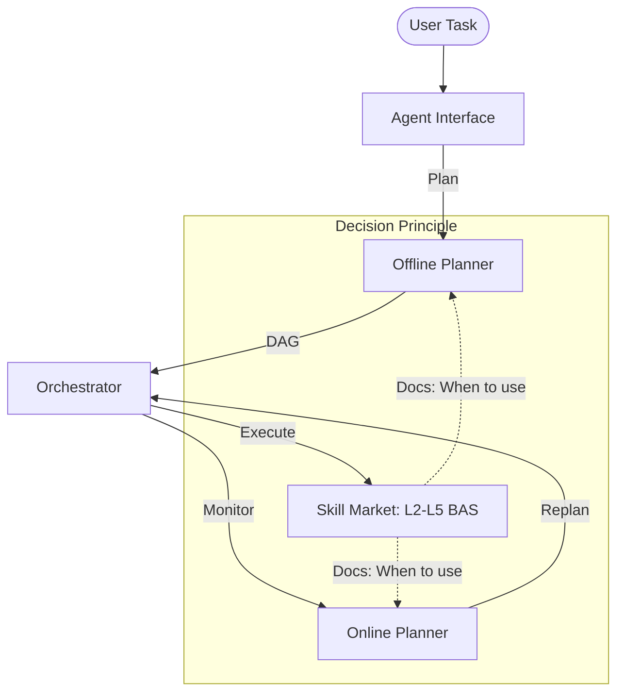

# 🛡️ ASGARD: The Intelligent Battery Brain

[English] | [简体中文](README_CN.md)

> **The Ultimate Orchestrator for Next-Generation Battery Management Systems (BMS)**

ASGARD is not just a workflow engine; it is the cognitive layer for battery intelligence. By bridging the gap between high-level **Agent Reasoning** and low-level **Electrochemical Skills**, ASGARD enables autonomous, high-precision battery diagnostics and optimization at scale.

---

## 🌟 Why ASGARD?

In traditional BMS, algorithms are fragmented and hard-coded. ASGARD redefines this via:

-   **🧠 Documentation-Driven Orchestration**: Decisions are governed by first principles. Our planners parse the `## When to use this skill` directives in `SKILL.md` to select the right algorithm for the right context (e.g., Temperature, SoC, Age).
-   **⚡ Autonomous Self-Healing**: Powered by the **Online Planner**, ASGARD detects node failures or accuracy drops in real-time and self-corrects in `<50ms` without human intervention.
-   **🧩 Adaptive DAGs**: Workflows are no longer static. They mutate at runtime to provide deep insights where they are needed most, and speed where efficiency is critical.

---

## 🏗️ Architecture



---

## 🚀 Quick Start in 60 Seconds

Experience the power of documentation-driven orchestration immediately.

### 1. Simple Deployment
```bash
# Clone & Enter
git clone https://github.com/kaowaya/ASGARD.git && cd ASGARD

# Start the Intelligence Layer
docker-compose up -d
```

### 2. Autonomous Orchestration Demo
Run our interactive simulation to see the Agent and Online Planner in action:
```bash
python workflow/demo_agent_orchestration.py
```

---

## 🧪 Validated Excellence

ASGARD is grounded in real-world data. Our **L3-Cloud Algorithms** have been rigorously tested against simulated ESS data from the **Huanggang Project**, identifying:
-   **Internal Short Circuit (ISC)** detection with P2D models.
-   **Lithium Plating** signature analysis during relaxation.
-   **Safety Entropy** as a predictive health indicator.

> [!TIP]
> View detailed validation reports in `BAS/L3-云端层级/test_results.txt`.

---

## 📂 Navigation for Professionals

-   **[BAS Skills Library](file:///d:/ASGARD/BAS/)**: The core algorithmic assets from L2 (BMS) to L5 (Industrial).
-   **[Architectural Blueprint](file:///d:/ASGARD/docs/workflow-v2/architecture-update.md)**: Deep dive into the Agent-Workflow integration.
-   **[Changelog](file:///d:/ASGARD/CHANGELOG.md)**: Evolution of the ASGARD ecosystem.

---

## 🧠 Deep Dive: Progressive Disclosure

ASGARD follows the philosophy of Progressive Disclosure. For beginners or AI Agents, we recommend the following path:

1.  **[Design Philosophy & Ontology](file:///d:/ASGARD/claude.md)**: Understand the core thinking behind ASGARD (Occam's Razor, Ontology, etc.).
2.  **[BAS Skills Catalog](file:///d:/ASGARD/产品设计/ASGARD-BAS-Skills目录.md)**: A comprehensive overview of algorithmic assets.
3.  **[Product Design Vault](file:///d:/ASGARD/产品设计/)**: Explore the electrochemical essence of algorithms and the evolution of the Workflow architecture.
    -   *Recommended Reading*: **[Core Algorithm Competitiveness Analysis](file:///d:/ASGARD/产品设计/ASGARD-核心算法竞争力分析.md)**

---

## 💼 Collaboration & Vision

ASGARD is built on the philosophy of **Occam’s Razor**: *Entities should not be multiplied beyond necessity.* We prioritize clarity, performance, and electrochemical accuracy.

**Copyright © 2026 ASGARD Team | Built for the Future of Energy Storage.**
