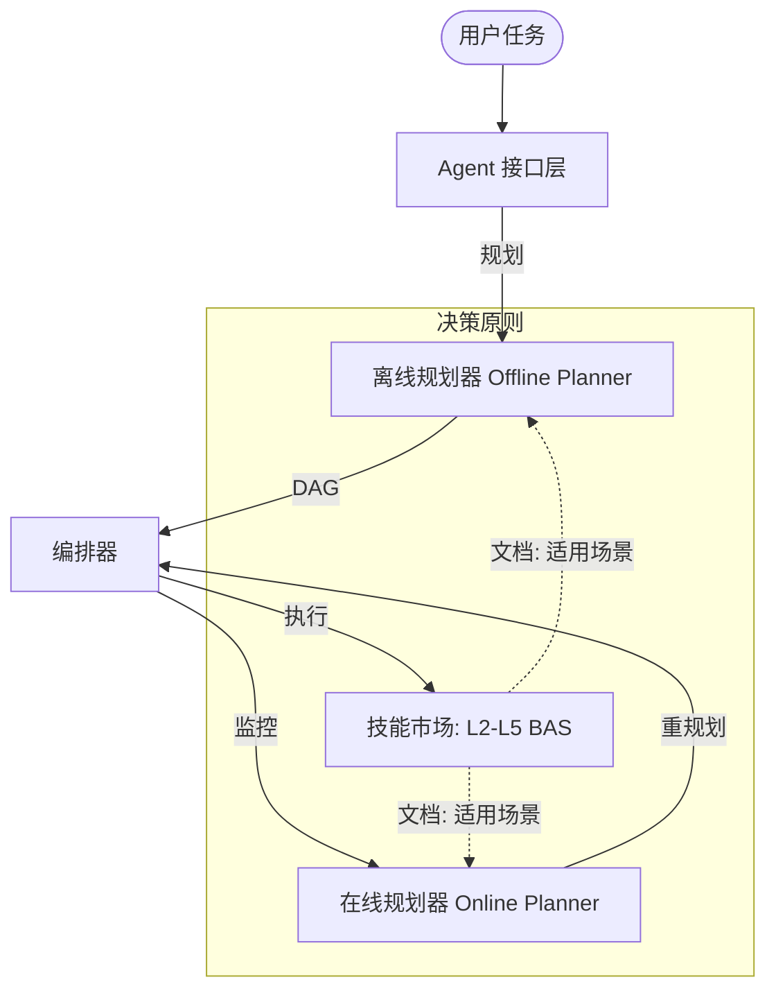

# 🛡️ ASGARD: 智慧电池大脑

> **面向下一代电池管理系统 (BMS) 的终极动态工作流编排器**

ASGARD 不仅仅是一个工作流引擎；它是电池智能的认知层。通过架起高层 **Agent 推理**与底层 **电化学算法 (Skills)** 之间的桥梁，ASGARD 实现了大规模的自主、高精度电池诊断与优化。

---

## 🌟 为什么选择 ASGARD?

在传统的 BMS 中，算法往往是碎片化且硬编码的。ASGARD 通过以下方式重新定义了这一领域：

-   **🧠 文档驱动编排 (Documentation-Driven Orchestration)**：决策遵循第一性原理。我们的规划器解析 `SKILL.md` 中的 `## When to use this skill` 指令，根据上下文（如温度、SoC、寿命阶段）选择最合适的算法。
-   **⚡ 自主自愈 (Autonomous Self-Healing)**：由 **Online Planner** 驱动，ASGARD 实时检测节点失败或精度下降，并在 `<50ms` 内完成自主修正，无需人工干预。
-   **🧩 动态 DAG (Adaptive DAGs)**：工作流不再是静态的。它们在运行时动态演变，在需要深度洞察时提供精度，在需要效率时提供速度。

---

## 🏗️ 系统架构



---

## 🚀 60 秒快速上手

立即感受文档驱动编排的力量。

### 1. 极简部署
```bash
# 克隆并进入目录
git clone https://github.com/kaowaya/ASGARD.git && cd ASGARD

# 启动智能层
docker-compose up -d
```

### 2. 自主编排演示
运行我们的交互式模拟，观察 Agent 与 Online Planner 的协同工作：
```bash
python workflow/demo_agent_orchestration.py
```

---

## 🧪 卓越验证

ASGARD 植根于真实数据。我们的 **L3 云端算法** 已针对来自 **黄岗场站项目** 的模拟 ESS 数据进行了严格测试，成功识别：
-   **内短路 (ISC)**：使用 P2D 模型进行高精度检测。
-   **析锂 (Lithium Plating)**：利用充电后弛豫特性进行特征分析。
-   **安全熵 (Safety Entropy)**：作为预测性健康指标。

> [!TIP]
> 查看详细的回测结果报告：`BAS/L3-云端层级/test_results.txt`。

---

## 📂 开发者导航

-   **[BAS 算法库](file:///d:/ASGARD/BAS/)**：从 L2 (BMS级) 到 L5 (工商业级) 的核心算法资产。
-   **[架构蓝图](file:///d:/ASGARD/docs/workflow-v2/architecture-update.md)**：深入了解 Agent-Workflow 集成设计。
-   **[更新日志](file:///d:/ASGARD/CHANGELOG.md)**：ASGARD 生态的演进历程。

---

## 🧠 深度探索：渐进式披露 (Progressive Disclosure)

ASGARD 遵循渐进式披露的设计哲学。如果您是初学者或 AI Agent，建议按以下路径深入：

1.  **[设计哲学与本体论](file:///d:/ASGARD/claude.md)**：了解 ASGARD 的核心设计思想（奥卡姆剃刀、本体论等）。
2.  **[BAS 技能目录](file:///d:/ASGARD/产品设计/ASGARD-BAS-Skills目录.md)**：全面了解算法资产的分类与能力。
3.  **[产品设计文档库](file:///d:/ASGARD/产品设计/)**：深入探讨 BAS 算法的物理本质、Workflow 的架构演进以及竞争力分析。
    -   *推荐先读*：**[核心算法竞争力分析](file:///d:/ASGARD/产品设计/ASGARD-核心算法竞争力分析.md)**

---

## 💼 愿景与协作

ASGARD 秉承 **奥卡姆剃刀原则**：*如无必要，勿增实体。* 我们优先考虑清晰度、性能和电化学准确性。

**Copyright © 2026 ASGARD 团队 | 为储能未来而生。**
